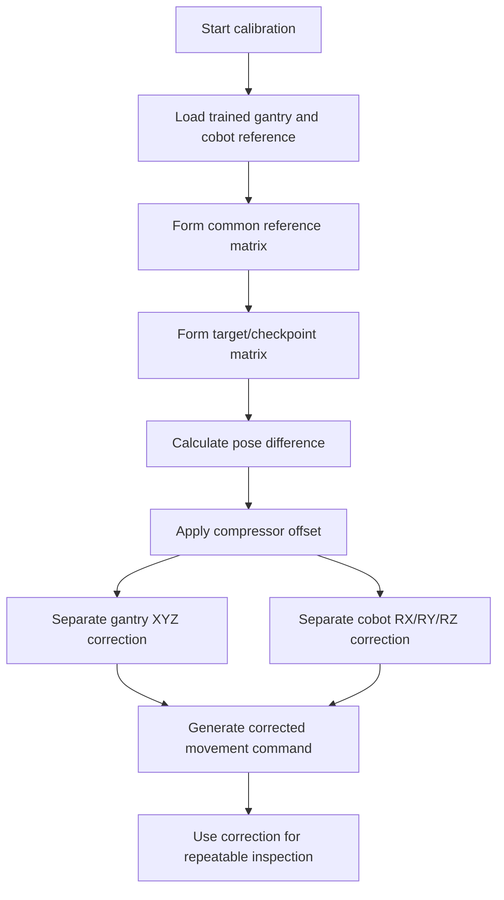

# Compressor Camera-Cobot Calibration

A portfolio case-study project demonstrating a Python-based calibration workflow for an industrial compressor inspection cell using gantry movement, UR cobot pose transformation, and compressor offset correction logic.

> This repository is a sanitized portfolio version. It explains the engineering concept and software structure without exposing company-confidential data, customer information, PLC IP addresses, credentials, production images, or proprietary configuration.

## Project Summary

In an industrial inspection system, even a small compressor placement change or gantry/cobot alignment drift can affect camera view, inspection point repeatability, and OK/NG decision stability.

This project demonstrates how calibration and offset compensation can be handled using transformation matrices, reference poses, and correction logic between:

- Gantry XYZ position
- UR cobot 6D pose `[x, y, z, rx, ry, rz]`
- Compressor offset `[x, y, z, rx, ry, rz]`
- Trained reference point
- Target inspection/checkpoint pose

## Why This Matters

Industrial vision systems are sensitive to positional variation. A few millimeters of shift can cause ROI mismatch, inconsistent image capture, and false inspection results.

This calibration module supports repeatable inspection by calculating how the current system pose relates to the trained pose and applying the required gantry/cobot correction.

## Key Capabilities

- Forms gantry and cobot homogeneous transformation matrices
- Converts UR pose lists into matrix representation
- Calculates pose difference between common reference and target reference
- Applies compressor offset to generate corrected reference movement
- Separates gantry XYZ correction and cobot rotational correction
- Supports direct gantry/cobot offset application through a simplified helper class
- Includes sample data, documentation, and test scaffold for portfolio review

## Technology Stack

| Area | Tools / Concepts |
|---|---|
| Language | Python |
| Math | NumPy matrix multiplication, inverse transforms |
| Robotics | UR pose, axis-angle rotation, coordinate frame transformation |
| Robot Math | RoboDK `robomath` |
| Automation Context | Gantry, cobot, camera-guided inspection, compressor calibration |
| Portfolio Support | Markdown documentation, sample JSON, test scaffold |

## Repository Structure

```text
compressor-camera-cobot-calibration/
├── README.md
├── src/
│   └── compressor_calib.py
├── docs/
│   ├── calibration_concept.md
│   ├── coordinate_transformation.md
│   ├── offset_correction_logic.md
│   ├── system_architecture.md
│   └── confidentiality_note.md
├── samples/
│   ├── sample_training_data.json
│   ├── sample_calibration_result.json
│   └── sample_offset_log.txt
├── tests/
│   └── test_basic_contract.py
├── diagrams/
│   └── calibration_flow.mmd
├── requirements.txt
├── .gitignore
└── LICENSE
```

## Core Code

The main program is available at:

```text
src/compressor_calib.py
```

Important classes:

| Class | Purpose |
|---|---|
| `Formation` | Creates gantry/cobot/offset matrices and converts between UR pose and matrix formats |
| `Calculate` | Implements the full reference-to-target calibration pipeline |
| `Calculate2` | Applies simplified compressor offset correction to gantry and cobot poses |

## High-Level Calibration Flow



## Example Use Case

A compressor is placed on a trolley inside an inspection station. During training, reference points are recorded. Over time, mechanical shift, trolley placement variation, or system drift may cause the actual reference to deviate from the trained position.

This module calculates the required correction so that inspection points remain aligned with the compressor reference.

## Skills Demonstrated

- Python-based industrial automation logic
- Robotics coordinate transformation
- Cobot pose handling
- Gantry/cobot frame relationship
- Calibration offset calculation
- Matrix-based movement correction
- Production inspection repeatability thinking
- Engineering documentation for maintainability

## How to Run

Install dependencies:

```bash
pip install -r requirements.txt
```

Run the sample calculation:

```bash
python src/compressor_calib.py
```

Note: This project uses RoboDK robot math helpers. If RoboDK is not installed, the main script will not execute until the `robodk` Python package is available.

## Confidentiality Note

This repository does not contain real customer data, PLC IP addresses, camera serial numbers, database credentials, production images, or proprietary inspection configuration. Sample values are used only to demonstrate the calibration concept.

## Author

Akash K  
Industrial Automation & Robotics Software Engineer  
Python | Cobot Integration | Machine Vision | PLC Communication | Database-Driven Inspection Systems
